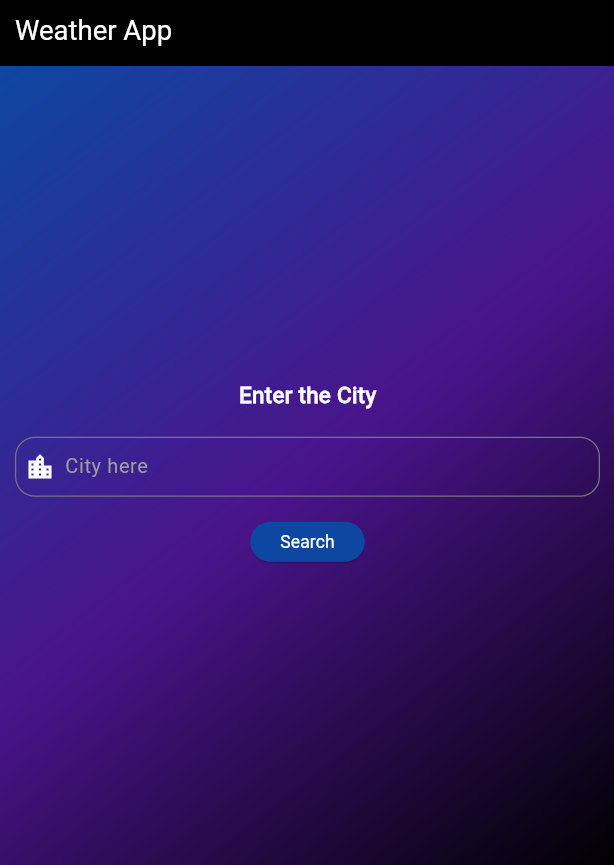
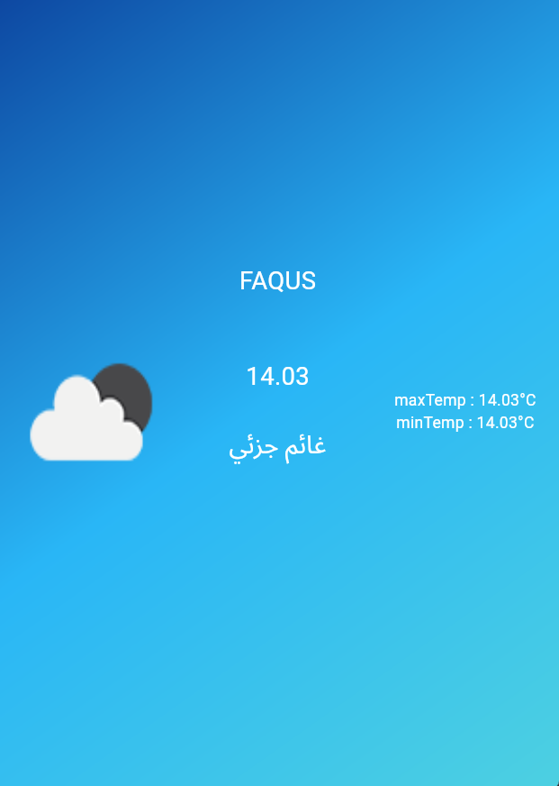
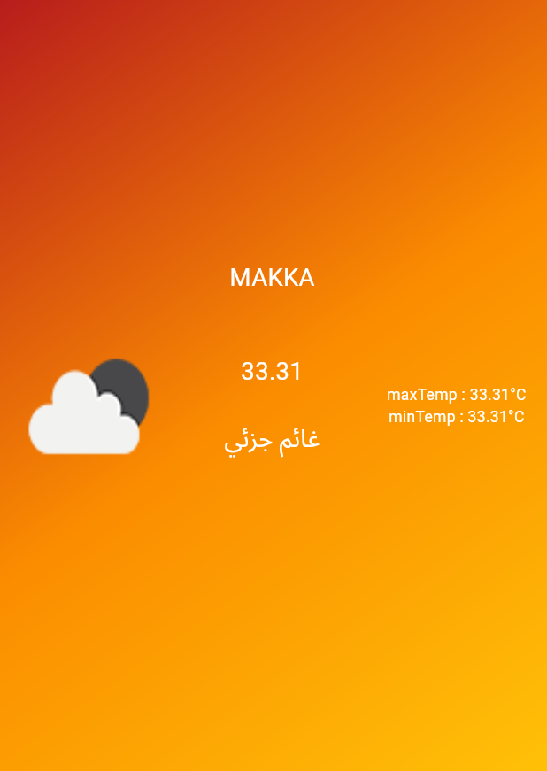

# 🌦️ Weather App

A simple and elegant **Flutter** application that provides real-time weather updates for any city worldwide.

## ✨ Features

✅ **Current Weather** – Displays temperature, humidity, wind speed, and weather conditions.  
✅ **Search Functionality** – Enter a city name to get live weather data.  
✅ **Beautiful UI** – Dynamic background changes based on weather conditions.  
✅ **Dark & Light Mode** – Supports both themes for better user experience.  
✅ **Weather Forecast** – Get a 5-day forecast with daily updates.

---

## 🛠️ Technologies Used

- **Flutter** 💙 – Cross-platform mobile framework.
- **Dart** 🚀 – The programming language behind Flutter.
- **OpenWeatherMap API** ☁️ – For fetching real-time weather data.

---

## 📷 Screenshots

### 🌍 Weather Home Page
This is the main screen where users can search for cities and view the current weather.

### 🏙️ City Weather Page
This screen shows detailed weather information for the selected city.

| City Weather View 1                                      | City Weather View 2                                      |
|----------------------------------------------------------|----------------------------------------------------------|
|  |  |

---

## 🚀 How to Run the App?

1️⃣ Clone the repository:
git clone https:github.com/AhmedSaleh74/Weather-Application
2️⃣ Navigate to the project directory:
cd Weather-Application
3️⃣ Install dependencies:
flutter pub get
4️⃣ Run the app:
flutter run

🔗 API Key Setup
To fetch weather data, you need an API key from OpenWeatherMap.

Sign up at OpenWeatherMap and generate an API key.
Add the API key in your constants.dart file:
const String apiKey = "YOUR_API_KEY";

📌 Future Enhancements
✅ Add location-based weather detection 🌍
✅ Implement hourly forecast ⏳
✅ Improve UI animations ✨
✅ Add notifications for weather alerts 🔔

🔹 **Developed by Ahmed Saleh**  
🔹 **Let's Connect:** [LinkedIn](https://www.linkedin.com/in/ahmed-saleh-054651219/) | [GitHub](https://github.com/AhmedSaleh74)  